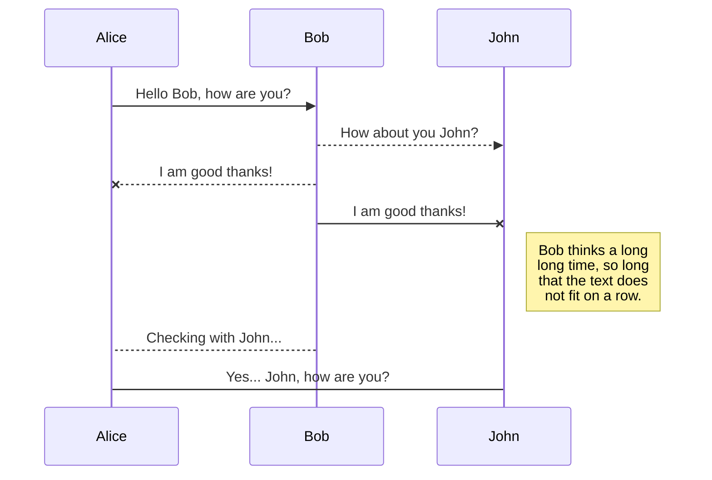
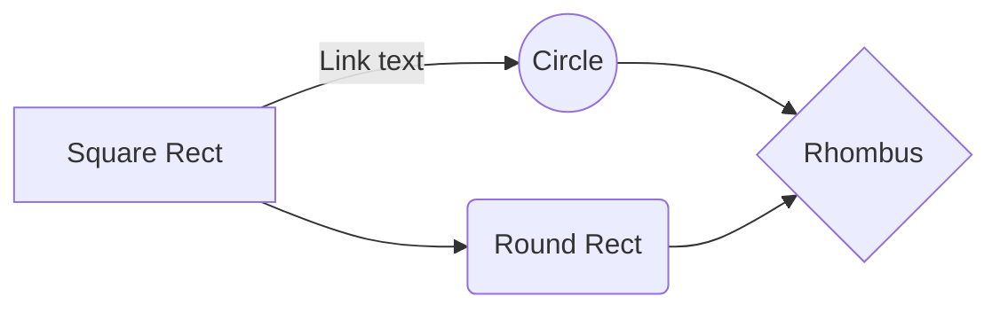

# MEANt

**
/*
 * @author Nilakantha Singh Deo
 * @email nsinghdeo@protonmail.com
 * @create date 2018-05-06 02:37:32
 * @modify date 2018-05-06 02:37:38
 * @desc [description]
*/

# WHy

There are a lot many web frameworks to write a node based full stack application(Refer javascript based web frameworks)
Each framework has its own priorities and built around different philosophies . As a beginer I liked Express a lot and growing up fell in love with loopback from strongloop.

This repository is my long wish to write a finished MEAN stack application (with AngularJS 1.6 not Angular which is TS). Feel free to find flaws.

I have added and will keep on adding the challenges I have faced during my process of learning .
 

## Create files and folders

1. [server.js]
    a)body-parser
    b)need for X-HTTP-Method-Override 
    c)separating the routes unlike the express boilerplate

2. [db.js] in config

3. [routes] file in app folder

4. created [user.js] file to include models through mongoose

5. created [public] folder and the index.html file which is required 
for fronted routing
    a)faced issue with res.sendfile vs res.sendFile
    b)It requires absolute path not relative path for sending file

6. pulled [bower] creating .bowerrc and bower.json file
    a)inside bower.json file just add name and give a name
    b)then bower install <package1_name package2_name> --save
    c)inside bowerrc file provide the path for the package to get downloaded
    
7. [$location] in HTML5 mode requires a <base> tag to be present!
8. 

## javascript based web frameworks

| s/n              |Web Frameworks                |Use it for          		   										|
|----------------|------------------------------|-------------------------------------------------------------------|
|1 |[actionheros](https://www.actionherojs.com/)|IOT,Real time Chat,Game apps      									|
|2 |[derby](http://derbyjs.com/)        		|Server side rendering(realtime collaberation)						|
|3 |[express](https://expressjs.com/)			|Most popular and easy to pickup(good for a starter todoApp			|
|4 |[hapi](https://hapijs.com/) 				|Great one with good documentation and lesser complex modularity 	|
|5 | [keystone.js](http://keystonejs.com/)		|Good for database-driven websites(easy pluggable UIs)				|
|6 |[koa](https://koajs.com/)					|Removed middleware from the core module so bit simpler				|
|7 |mean.io										|Preloaded(GrphQL,webpack,React,Gulp,Babel,mocha)					|
|8 |[metor](https://www.meteor.com/)			|Use the same code across IOS,Android(compatible for React and Vue)	|
|9 |[restify](http://restify.com/)				|Production ready/symmantically correct								|
|10|[sails](https://sailsjs.com/)				|Professional support and auto-generated REST APIs(great MVC fw)	|
|11|[loopback](https://loopback.io/)			|Great for building REST layer with scaffolded UI(from Strongloop)	|

## KaTeX

You can render LaTeX mathematical expressions using [KaTeX](https://khan.github.io/KaTeX/):

The *Gamma function* satisfying $\Gamma(n) = (n-1)!\quad\forall n\in\mathbb N$ is via the Euler integral

$$
\Gamma(z) = \int_0^\infty t^{z-1}e^{-t}dt\,.
$$

> You can find more information about **LaTeX** mathematical expressions [here](http://meta.math.stackexchange.com/questions/5020/mathjax-basic-tutorial-and-quick-reference).

## UML diagrams

You can render UML diagrams using [Mermaid](https://mermaidjs.github.io/). For example, this will produce a sequence diagram:

And this will produce a flow chart:

